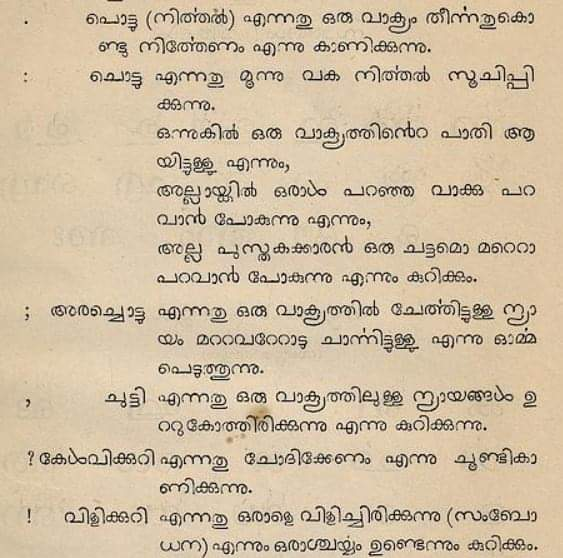

# About Malayalamozhi

### Pure Malayalam

Pure Malayalam or Pacha Malayalam is not an ultra purism movement or language extremism. On the contrary, it is a benefaction provided to the future by Malayalam language of the present and past.

#### What is Manipravalam?

> Bhāṣā saṁskr̥ta yōgō maṇipravāḷaṁ

The term Manipravalam is a combination of two words, __maṇi__, which denotes the Dravidian language of Malayalam and __pravāḷam__, which denotes the Sanskrit language. Manipravalam is the construction of Sanskrit vocabulary on top of Pure Malayalam’s base to produce a specific style of poetry. In linguistics these kinds of amalgamations are referred to as Macronic Languages.

Example:

> 1,00,000 മുതൽ 50,000 __വർഷങ്ങൾക്കു മുമ്പ്__, __ആദ്യകാല മനുഷ്യ നാഗരികതയുടെ__ തെളിവുകൾ __ഗുഹാചിത്രങ്ങളിലൂടെ__ കാണാൻ __ആരംഭിച്ചു__; ഇതും __ഭാഷയും__ തമ്മിലുള്ള __ബന്ധം__ ആർക്കും അറിയില്ല. __മസ്തിഷ്കം__ പെട്ടെന്ന് __വികസിക്കുന്നില്ല__, എന്നിട്ടും __മനുഷ്യർ__ കൂടുതൽ __സങ്കീർണ്ണ ചിന്താഗതിയുള്ളവനും ബുദ്ധിമാനും__ ആയിത്തീർന്നു. __ഭാഷ__ __ഉപയോഗിച്ച്__ ആയിരിക്കുവോ അവരുടെ __മസ്തിഷ്കം വികസിക്കാൻ കാരണമായത്?__ അതോ അവരുടെ __സങ്കീർണ്ണമായ മസ്തിഷ്കം ഭാഷ ഉത്പാദിപ്പിക്കാൻ__ തുടങ്ങിയോ?

You can read the same line in Pure Malayalam under this article

In the above sentence, those words which are in bold style came to Malayalam due to Manipravalam.

#### Why Pacha Malayalam?

The Sanskrit loan words were popularised as Standard Malayalam with the work done by Sanskrit institutions, and public education that favoured elitism. Majority of these words do not fit into the native phonology of Malayalam language, and Tatsama (original from Sanskrit) were preferred over Tadhbhava words. Tadhbhava words agreed upon the native phonological rules of Malayalam language.
  
This led to the demise of pure vocabulary in the language. Besides, the difficulty in pronouncing these words, made people switch to English vocabulary. Although this act of using Sanskrit loans unnecessarily faced criticism, the mass media and educational institutions haven’t bothered much, all because of Sanskrit being regarded as superior to Malayalam.
  
Loan words are indispensable in languages, However, in case of Malayalam language, the majority of the loans are inessential, and it emphasises the superiority of the lender and makes the language which takes all these loans look weaker. This is where the concept of Pacha Malayalam comes in.
  
A major portion of the pure words in Malayalam are thousands of years old (archaeological and literary evidences). The following image is a hero stone carved in a variant of the Tamil Brahmi script, which was submitted to the Classical Language committee for Malayalam. This came as an article in the India Today Malayalam Magazine (27 October 2010) written by N.G. Nayanatara.
  

 
This inscription is in Pure Malayalam language, and is almost 2100 years old. Thus, Malayalam transcends the antiquity of many languages like English, French etc.

The words such peṭu and tīyan are not found in Tamil, as well the ā (showing direction/distance) being written independently, which is still used, are some evidences of Malayalam’s antiquity.

#### Is Pacha Malayalam a new concept?

During the 19th Century, the Pacha Malayalam movement took efforts to reduce the exceeding amount of Sanskrit loans in Malayalam language, mainly through poetry. Malayalam and Sanskrit scholars came forward to prevent Malayalam’s ‘total destruction’. Although, their works known as the Venmani Kavithakal had a slight impact, they were mostly confined to literature.
 

#### Isn’t Pacha Malayalam just Tamil?

Vocabulary alone doesn’t determine a language. How it is used, and which mode, determines a language. Below is a comparative analysis of Scandinavian languages, which are considered as distinct languages.

English : What is your name?

> Swedish : Vad heter du?
  Danish : Hvad hedder du?
  Norwegian : Hva heter du?

One can see how similar are these languages, yet they are regarded as independent languages.

Now let’s compare Tamil and Malayalam

* uṅkaḷ peyaṟ eṉṉa?

* Malayalam: niṇgaḷuṭe pērŭ entāṇ?

_āṇ_ roughly translating to ‘is’, is extensively used in Malayalam, but not in Tamil.

However, if we add ākum (what will become), at the end of that Tamil question, it is still not similar to Malayalam. On the contrary it changes the meaning completely.

Many other linguistic aspects such as phonetic variations, syntax, style etc. shows clear distinction between Tamil and Malayalam.

### Is Pacha Malayalam possible?

Instead of deriving complex words for new terminology from Sanskrit, which is usually discarded by Malayalam speakers, words that fit neatly into the native phonology should be derived. This will enrich Malayalam language.

Words that came from other languages and agrees with the native phonology such as ēṇi (ladder), tīram (shore), pēṉa (pen) should be retained as Malayalam.

If, the argument is that there is no wrong in using exact Sanskrit words in Malayalam, then there is no wrong in using Esperanto’s vocabulary in Malayalam. But this unneeded act of borrowing degrades a Classical language like Malayalam.

___

### The Project

1. Promote the use of pure Malayalam alternatives instead of loan words
2. Revive words that are not used any more, but were used by older generations, or in literature to enrich the vocabulary.
3. New words to be derived from Dravidian roots.
4. Using the simple logic of combining Pure Malayalam multiple words to convey new ideas.
5. Give new senses to obsolete Pure Malayalam words.
6. Revive letters such as ഩ (ṉ) to avoid confusion with pronunciation and minify the Malayalam script by reducing the usage of uncommon aspirants.
7. Promote the use of Pacha Malayalam through modern literature.

### Modern Literature

Provided below is a recent Novel by Manoj Kurur which do not uses Sanskrit letters such as ഋ,ൠ,ഖ,ഗ,ഘ,ഛ,ജ,ഝ,ഠ,ഡ,ഢ,ഥ,ദ,ധ,ഫ,ബ,ഭ,ശ,ഷ,സ,ഹ and is written predominantly in pure Malayalam and a couple of Tadhbhava words.

### Writitng in Pure Malayalam

> 1,00,000 മുതൽ 50,000 കൊല്ലങ്ങൾക്ക് മുമ്പ്, തുടര്‍നാളുകളിലെ നാട്ടുപ്പാർപ്പിന്റെ തെളിവുകൾ കല്ലളവരപ്പുകളില്‍ കാണാൻ തുടങ്ങി; ഇതും മൊഴിയും തമ്മിലുള്ള അടുപ്പം ആർക്കും അറിയില്ല. തലച്ചോർ പെട്ടെന്ന് വലുതാകുന്നില്ല, എന്നിട്ടും ആളുകൾ കൂടുതൽ ചിക്കലാവുകയും മൂളയുള്ളവരും ആയിത്തീർന്നു. മൊഴിയാല്‍ ആയിരിക്കുവോ അവരുടെ തലച്ചോർ വിടരാൻ ഇടയായത്? അതോ അവരുടെ ചിക്കലായ തലച്ചോർ മൊഴി മഩയാൻ തുടങ്ങിയോ?

Tamil 

> 1,00,000 മുതൽ 50,000 ആണ്ടുകളുക്കു മുൻപു, ആരമ്പകാല മനിത നാകരികത്തിൻ ചാൻറുകൾ കുകൈ വരൈപടങ്കളിൽ കാണത് തൊടങ്കിന; ഇതറ്കും മൊഴിക്കും ഉള്ള തൊടർപു യാരുക്കും തെരിയാതു. മൂളൈ വേകമാക വളരവില്ലൈ, ആനാലും മനിതർകൾ മികവും ചിക്കലാനവർകളാകവും പുത്തിചാലിത്തനമാകവും ആനാർകൾ. മൊഴി പയൻപാടു അവർകളിൻ മൂളൈ ഉരുവാക കാരണമാക ഇരുന്തതാ? അല്ലതു അവർകളിൻ ചിക്കലാന മൂളൈ മൊഴിയൈ ഉരുവാക്കത് തൊടങ്കിയതാ?

_____________________

__If you find this project interesting, please consider contributing to the Pacha Malayalam Project.__

contact us!

